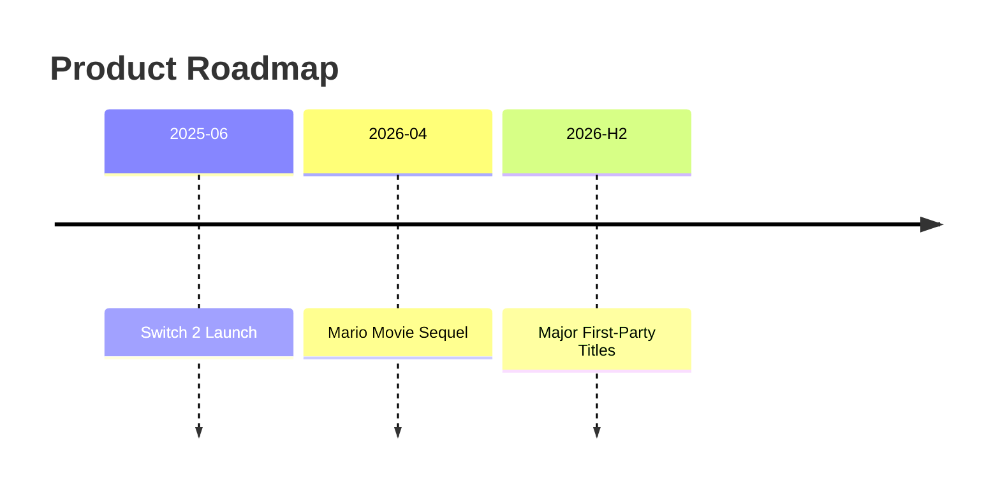
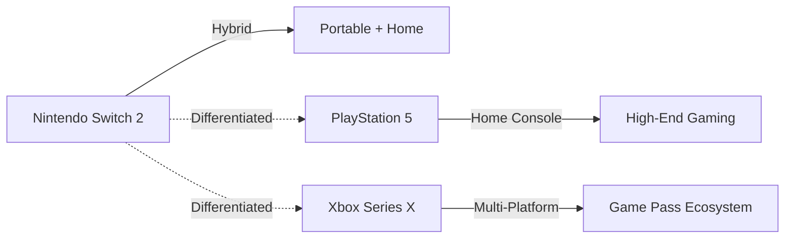

# Custom Slidev Theme Presentation Guide

This skill provides guidelines for generating Slidev presentations using the custom theme located at `skills/my-slidev/theme`. For Slidev syntax and features, refer to /slidev.

## Headmatter Template

Every presentation must start with this headmatter. Resolve `<absolute-path-to-skills/my-slidev/theme>` to the actual filesystem path at generation time (e.g., `/home/<user>/.claude/skills/my-slidev/theme`).

```yaml
---
theme: <absolute-path-to-skills/my-slidev/theme>
title: <Presentation Title>
author: <Author Name>
fonts:
  sans: M PLUS Rounded 1c
  provider: google
---
```

**Layout-specific frontmatter**: The `two-cols` layout supports a `columns` prop (e.g., `columns: "2:1"`) to set column width ratio. See the Layout Selection Guide for details.

## Layout Selection Guide

| Layout | When to Use | Markdown Pattern |
|--------|-------------|------------------|
| `cover` | First slide only. Title of the presentation + author name. | `# Title` followed by author name as paragraph |
| `bullets` | Content slides with a header (left accent border using `--c-primary`) and supporting points. Use for most content slides. | `::header::` with `# Title`, then `::default::` with `- bullet` items |
| `bullets-sm` | Reference slides, bibliography, or any slide needing smaller text with a header. Same structure as `bullets` with smaller text and no bullet markers. | Same as `bullets`: `::header::` with `# Title`, then `::default::` with `- bullet` items |
| `two-cols` | Side-by-side comparisons, text+code, text+image, data+analysis. Two columns with a shared header. | `::header::` with `# Title`, then `::left::` and `::right::` slots. Set `columns: "2:1"` in frontmatter for ratio. |
| `blank` | Slides that need free-form content: tables, diagrams, custom HTML, large text blocks, or anything that doesn't fit the bullets pattern. | Any markdown content. Add `class: v-center` for vertical centering. |

## Content Structuring Rules

1. **One topic per slide** — each slide conveys a single idea or concept
2. **Max 5 bullets per slide** — if more points are needed, split into multiple slides
3. **Bullet text: max ~15 words** — keep bullets concise; use sub-bullets sparingly
4. **First slide is always `cover`** — with presentation title and author
5. **Default to `bullets` layout** — use `blank` for tables, diagrams, or free-form content
6. **No nested layouts** — one layout per slide, no layout nesting

## Content Overflow Guidelines

Every slide's content must fit on a single slide. After generating slides, review each one and ask: "Would this content be fully visible and legible when projected?"

### Overflow Signals

| Content Type | Overflow Signal |
|---|---|
| Bullets | Exceeds thresholds in Content Structuring Rules (rules 2-3) |
| Tables | Too many rows or columns to render without clipping |
| Code blocks | Too many lines to fit in the slide viewport |
| Mermaid diagrams | Too many nodes/edges to render legibly |
| Headers/titles | Text too long to fit on one line |
| Mixed content | Combined elements (e.g., heading + table + bullets) exceeding slide capacity |

### Remediation Strategies

| Strategy | When to Apply |
|---|---|
| **Split into multiple slides** | Content has natural breakpoints (e.g., long bullet lists, large tables) |
| **Make content more concise** | Content can be shortened without losing meaning (e.g., verbose bullets, redundant rows) |
| **Change layout** | A different layout would accommodate the content better (e.g., switch from `bullets` to `blank` for complex slides) |
| **Simplify diagrams** | A Mermaid diagram has too many elements — reduce nodes or break into multiple diagrams |

## Bullet Markers

The theme renders custom bullet markers automatically:
- **Top-level bullets**: filled blue circle (matches `--c-primary`)
- **Nested bullets**: hollow blue circle outline

Just use standard markdown `- item` syntax. No special markup needed.

**Exception:** The `bullets-sm` layout has no bullet markers — items display without marker circles, suitable for reference lists starting with `[N]`.

## Page Numbers

The theme automatically displays page numbers on `bullets` layout slides:

- **Format**: `current/total` (e.g., `03/12`), zero-padded based on total slide count
- **Position**: Bottom-right corner, subtle gray text
- **Visibility**: `bullets`, `bullets-sm`, and `two-cols` layouts only — page numbers do NOT appear on `cover` or `blank` layouts
- **Automatic**: No author action needed. Page numbers are rendered by the theme.

## Color Usage

### Design Tokens

| Token | Color | Use For |
|-------|-------|---------|
| `--c-primary` | Blue (blue-600) | Key metrics, important numbers, links |
| `--c-accent` | Orange (orange-500) | Warnings, highlights that need attention |
| `--c-positive` | Green (green-600) | Positive trends, growth, upside |
| `--c-negative` | Red (red-600) | Negative trends, decline, risks, downside |
| `--c-important` | Purple (purple-600) | Critical points, must-know items (admonitions) |
| `--c-text-secondary` | Gray (neutral-500) | Supplementary info, annotations |

### How to Apply Colors

**Highlight component** (background + colored text, marker-style):

```md
- Revenue grew <Highlight type="positive">+99.3%</Highlight> year-over-year
- Margin dropped to <Highlight type="negative">37.4%</Highlight> from 59.1%
- Target price: <Highlight>¥16,000</Highlight>
- Tariff risk rated <Highlight type="accent">High</Highlight>
```

Available types: `primary` (default), `positive`, `negative`, `accent`, `important`

**Span utility classes** (text color only, lighter emphasis):

```md
- Full-year progress rate at <span class="c-primary">81.2%</span>
```

Available utility classes: `c-primary`, `c-accent`, `c-positive`, `c-negative`, `c-important`, `c-secondary`

Callout box (for key takeaways, summaries, warnings, definitions):
```md
<Admonition type="tip" title="Key Takeaway">

Summary text here

</Admonition>
```

See `techniques/admonition.md` for all types (`note`, `tip`, `important`, `warning`, `caution`, `formula`) and layout examples.

Lightweight alternative (no title or border — use only for minimal single-line highlights where `<Admonition>` would be too heavy):
```md
<div class="bg-primary-light">

**Brief highlight text**

</div>
```

### Color Discipline

- **1-2 colored elements per slide maximum** — color loses impact when overused
- **Use color for data, not decoration** — numbers and trends deserve color; generic text does not
- **Be consistent** — green always means positive, red always means negative throughout the deck
- **`<Highlight>` for strong emphasis** — use for the 1-2 most important data points per slide
- **`<span class="c-...">` for light emphasis** — use when a background tint would be distracting
- **Never color entire bullets** — only color the specific number or keyword that needs emphasis

## Tables and Diagrams

### When to Use Tables

Use tables (in `blank` layout) when presenting:
- **Comparative data** — side-by-side metrics, spec comparisons, scenario summaries
- **Structured metrics** — financial results, valuation indicators, risk matrices
- **Timeline data** — chronological events with associated values

The theme styles tables automatically: blue header row, alternating row backgrounds, clean borders.

```md
---
layout: blank
---

## Section Title

| Metric | FY2024 | FY2025 | Change |
|--------|--------|--------|--------|
| Revenue | ¥1.16T | ¥2.25T | <span class="c-positive">+93%</span> |
| Op. Margin | 24.2% | 16.4% | <span class="c-negative">-7.8pp</span> |
```

### When to Use Mermaid Diagrams

Use Mermaid diagrams (in `blank` layout) when presenting:
- **Flows and processes** — decision trees, workflows, cause-and-effect chains
- **Timelines** — product roadmaps, event sequences
- **Relationships** — competitive landscapes, organizational structures

````md
---
layout: blank
---

## Timeline


````

### Choosing Between Tables and Diagrams

| Content Type | Use |
|-------------|-----|
| Numbers, metrics, comparisons | **Table** |
| Processes, flows, relationships | **Mermaid diagram** |
| Timelines with dates + values | **Table** |
| Timelines showing sequence/flow | **Mermaid timeline** |
| Scenarios with multiple dimensions | **Table** |

## Layout Usage Examples

### Cover Slide

```md
---
layout: cover
---

# Presentation Title

Author Name
```

### Bullets Slide (with color)

```md
---
layout: bullets
---

::header::

# Quarterly Performance

::default::

- Q3 revenue reached <span class="c-primary">**¥806.3B**</span> (+86% YoY)
- Operating margin improved to <span class="c-positive">**19.25%**</span>
- Memory costs surged <span class="c-negative">**+41%**</span> in 3 months
- Full-year progress rate at 81.2%
```

### Bullets-sm Slide (references)

```md
---
layout: bullets-sm
---

::header::

# References

::default::

- [1] "Q3 2025 Earnings Report", https://example.com/q3-2025
- [2] "Operating Margin Analysis", https://example.com/margin
- [3] "Memory Cost Trends 2025", https://example.com/memory-costs
- [4] "Industry Outlook Report", https://example.com/outlook
- [5] "Competitive Landscape Survey", https://example.com/competitive
```

For multi-page references, use numbered titles (`# References (1/2)`, `# References (2/2)`, etc.).

### Table Slide

```md
---
layout: blank
class: v-center
---

## Risk Assessment

| Risk Factor | Severity | Timeline |
|-------------|----------|----------|
| Memory cost surge | <span class="c-negative">**High**</span> | Short-term |
| US tariffs | <span class="c-negative">**High**</span> | Short-term |
| FX risk (yen strength) | <span class="c-accent">**Medium**</span> | Medium-term |
| Regulatory risk | Low | Long-term |
```

### Diagram Slide

````md
---
layout: blank
---

## Competitive Landscape


````

### Blank Slide (free-form)

```md
---
layout: blank
---

Any content here — images, diagrams, custom HTML, etc.
```

## Visual Presentation Techniques

Avoid monotonous bullet-point slides. Vary the presentation with these techniques, documented in detail in the `techniques/` directory.

### Layout Variety Rule

| Slide Count | Minimum Non-Bullets Slides |
|-------------|---------------------------|
| 5-10 | 2+ |
| 11-20 | 4+ |
| 21+ | 6+ |

### Available Techniques

| Technique | When to Use | Reference |
|-----------|-------------|-----------|
| Two-column layout | Comparisons, text+image, text+code | techniques/two-column-layouts.md |
| Admonition boxes | Key takeaways, warnings, tips, definitions, formulas | techniques/admonition.md |
| Highlight markers | Inline emphasis with background tint for key figures | techniques/highlight.md |
| Code animations | Step-by-step code explanation | techniques/animations.md |
| Math formulas | Equations, formal notation | techniques/math-formulas.md |
| Font size control | Text wrapping at awkward positions, borderline overflow | techniques/font-size.md |

## Citation Rules

Citation rules apply to all presentations, regardless of whether the input content contains citations. Always verify the citation state of the output.

### Citation Ordering

Citations must be numbered sequentially by order of first appearance in the slides:

- Scan slides from first to last
- The first citation encountered becomes `[1]`, the second unique citation becomes `[2]`, etc.
- Citation numbers must **not** match the source report's numbering — always renumber for the presentation
- Example: if the source uses `[7]`, `[3]`, `[12]` and they appear in slides in that order, they become `[1]`, `[2]`, `[3]`

### Citation Correctness

Two-way consistency between slide body and references section:

| Rule | Description |
|---|---|
| **Body → References** | Every `[N]` cited in slide body text must have a corresponding entry in the References section |
| **References → Body** | Every entry in the References section must be cited at least once in the slide body |
| **No gaps** | Citation numbers must be contiguous (no skipping from `[1]` to `[3]`) |
| **No duplicates** | Each reference entry appears exactly once in the References section |

### No-Citation Case

If the presentation has no citations (e.g., input was an outline or notes without sources), verify that no orphan `[N]` markers exist in slide body text and no orphan References section exists.
